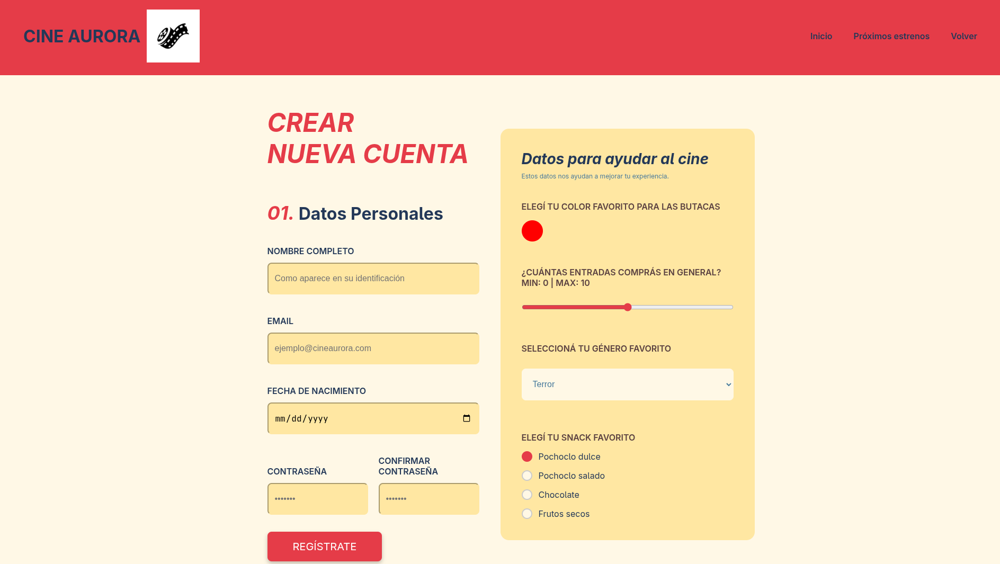

# 🎬 Cine Aurora - TP N°2 Programación III

## 📌 Descripción

El objetivo es maquetar la interfaz de una plataforma de cine llamada **Cine Aurora**, aplicando conceptos de:

- CSS Grid
- Flexbox
- Media Queries (Responsive Design)
- Modularización de estilos
- Buenas prácticas en HTML y CSS

---

## 👥 Integrantes - Grupo N7

- Iñaki Carcereny
- Valentin De Pascale
- Joaquin Marcilese
- Ezequiel Barrionuevo
- Alan Axel Hansen

---

## 🚀 Tecnologías utilizadas

- HTML5
- CSS3
- Flexbox
- Grid
- Media Queries

---

## 📄 Páginas implementadas

- **🎥 Detalle (`detalle.html`)**
  - Uso de Flexbox
  - Diseño reutilizable

  - Realizado por Alan Axel Hansen

- **🔐 Login (`login.html`)**
  - Formulario de inicio de sesión

  - Realizado por Iñaki Carcereny

- **📝 Registro (`registro.html`)**
  - Formulario de registro

  - Realizado por Valentin De Pascale

- **👤 Perfil (`perfil.html`)**
  - Información del usuario
  - Películas vistas

  - Realizado por Ezequiel Barrionuevo

- **🎞️ Estrenos (`estrenos.html`)**
  - Próximos lanzamientos

  - Realizado por Joaquin Marcilese

---

## 🎯 Funcionalidades

- Diseño responsive
- Navegación entre páginas mediante enlaces
- Modularización en componentes CSS
- Uso de pseudoclases (`:hover`, `:focus`)
- Variables CSS definidas en `:root`

---

## 🧩 Arquitectura CSS

- Organización modular en `/css/ruta/components`
- Uso de `@import` para integrar estilos
- Convención de nombres en **kebab-case**

---

## 📱 Responsive Design

Se implementaron **Media Queries** para asegurar una correcta visualización en:

- Dispositivos móviles
- Escritorio

---

## ▶️ Ejecución

Abrir el archivo `index.html` en cualquier navegador web.

---

## 🌿 Metodología de trabajo

* Cada integrante del grupo se encargo de una ruta.
* Uso de ramas: `main`, `dev` y ramas individuales.
* Creación de Pull Requests para integración.
* Merge final en rama `main` para la entrega.